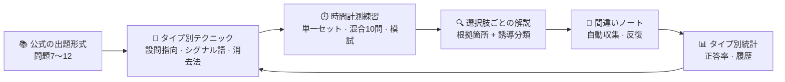

<div align="center">


# 読解特訓 · Yomitaku

**勝負に絞った JLPT N1 読解トレーナー——解法テクニック、時間計測練習、選択肢ごとの解説、間違いノート。すべて 1 枚の静的ページで**

[](https://mocas-12.github.io/jlpt-n1-Yomitaku/)
[](https://developer.mozilla.org/en-US/docs/Web/JavaScript)


**[🌐 ライブプレビュー (GitHub Pages)](https://mocas-12.github.io/jlpt-n1-Yomitaku/)**

*ページを開く → テクニックを学ぶ → 時間計測で練習 → 選択肢ごとの解説 → 間違いだけを反復*

[English](./README.md) | [简体中文](./README.zh-CN.md) | **日本語**

</div>

---

## 📖 目次

- [特徴](#-特徴)
- [スクリーンショット](#️-スクリーンショット)
- [UI デザイン](#-ui-デザイン)
- [特訓ループ](#-特訓ループ)
- [問題バンクと著作権](#-問題バンクと著作権)
- [プロジェクト構成](#-プロジェクト構成)
- [クイックスタート](#-クイックスタート)
- [開発](#-開発)
- [問題バンク JSON 形式](#-問題バンク-json-形式)
- [FAQ](#-faq)
- [プライバシーとセキュリティ](#-プライバシーとセキュリティ)
- [ライセンス](#-ライセンス)

## ✨ 特徴

- 🧭 **公式の出題形式に整理**：JLPT 公式『大問の試験目的』に対応づけ、問題 7〜12 の六大問タイプ（内容理解 短文/中文/長文、統合理解、主張理解、情報検索）ごとの専用戦術と時間配分をまとめた
- ⚡ **クイック技法ライブラリ**：設問指向の読み方、逆接・譲歩シグナル語の早見表（練習中ワンクリックでハイライト）、誘導選択肢を落とす 7 分類チェックリスト、110 分の時間配分表
- ⏱️ **時間計測練習**：各問題セットに難易度ベースの制限時間付きリアルタイムタイマー。超過は赤で表示され、本番の時間感覚を再現
- 🔍 **選択肢ごとの解説**：提出後、正解と自分の選択をマークし、全選択肢に本文の根拠箇所と誘導の分類を付与——ただの解答集ではない
- 🔁 **間違いノート ループ**：間違いは自動収集。「間違いを全部やり直す」に対応し、正解すれば項目は消える。試験前は間違いだけを反復
- 📊 **タイプ別統計**：問題タイプ別の正答率プログレスバー + 練習履歴——弱点がひと目で分かる
- 🎲 **ランダム混合 & 模試**：ワンタップで全タイプから 10 問をシャッフル、または公式の問題 7〜12 設計に沿って模試を組み立てグローバルタイマーで実施。設問ごとの所要時間は解説に表示
- 🔥 **連続学習日数**：履歴から算出した連続練習日数をホームに表示
- 📥 **拡張できる問題バンク**：JSON を貼り付け / ファイルをアップロードして自分の問題セットを取り込み（同一 ID は自動上書き）。バックアップ書き出しにも対応
- 📴 **インストール & オフライン（PWA）**：Web マニフェスト + 最小限のサービス ワーカー——ホーム画面に追加し、ネットなしで特訓を継続。SEO / Open-Graph の SNS メタタグも同梱
- 🌓 **ダークモード**：システム設定に追従しヘッダーでワンクリック切替——夜読みに合わせ調整した「夜の和紙」テーマ
- ⌨️ **キーボード解答**：1〜4 キーで現在の設問の選択肢を選び、Enter で提出——デスクトップなら最速で回せる
- 📝 **セッション下書き**：未提出の進捗は解答のたびに保存——誤ってリロードやタブを閉じても、タイマーが走ったまま続きから再開
- 🧳 **記録バックアップ**：正答率統計・履歴・間違いノートを JSON で書き出し/読み込みし、どのブラウザでも復元（問題バンクツールの隣に配置）
- 💾 **バックエンド ゼロ**：全データはあなたのブラウザの localStorage のみ——ダブルクリックで動く

## 🖼️ スクリーンショット

| ホーム | 練習エントリ（ランダム混合 & 模試） |
| --- | --- |
|  |  |

| 練習（シグナル語ハイライト） | 模試（グローバルタイマー） |
| --- | --- |
|  |  |

| 選択肢ごとの解説 | ダークモード（夜の和紙） |
| --- | --- |
|  |  |

## 🎨 UI デザイン

| 要素 | デザイン |
| --- | --- |
| 全体スタイル | 和紙テクスチャ（生成りベース + 朱色のアクセント + 墨色の文字）、フレームワークなしの手書き CSS |
| 読解エリア | 明朝体（Noto Serif JP）、行間 2 倍の両端揃え、試験問題の組版に近い |
| タイプバッジ | 青い問題タイプタグ + グレーの大問番号 + 出所バッジ（オリジナル / 取り込みがひと目で分かる） |
| 選択肢の状態 | ホバーで枠線 → 選択で藍色 → 正解は緑 / 誤答は朱色。解説ボックスは左の縦罫でガイド |
| シグナル語ハイライト | 23 種類の論理シグナル語（しかし・つまり・一方 など）をワンクリックでハイライト |
| モーション | ページのフェードイン、プログレスバーの遷移、トースト通知。重いアニメーションなし |
| ダークモード | 「夜の和紙」：藍墨ベース + 和紙白の文字、ハードシャドウは黒のシルエットのまま。システムに追従、ヘッダーで切替 |

## 🧠 特訓ループ



1. **学ぶ**：六つの問題タイプそれぞれの解法フロー、目標時間、誘導チェックリストを学習
2. **練習**：問題セットを選ぶ、全タイプから 10 問シャッフル、または模試を組み立て。タイマーは制限時間に対して走る（混合/模試はグローバル時計）。読解エリアではシグナル語ハイライトを ON にできる
3. **分析**：提出後、選択肢ごとの解説が各エラーを 7 分類の誘導カテゴリに振り分け——量より「なぜ引っかかったか」の帰属が大事
4. **反復**：間違いは自動でノートに入り、ワンクリックで再練習。クリアするまで回す
5. **復習**：ホームにタイプ別正答率と練習履歴を集約し、重点補強に使う

## 📚 問題バンクと著作権

> **誠実さ第一**：JLPT の過去問は公式からのみ入手でき、定番の市販問題集（新完全マスターなど）もすべて著作権のある書籍です——第三者が再公開することはできません。

- ✅ **内蔵問題バンク**：266 セット / 515 問、六タイプをフルカバー——公式の「大問の試験目的」（能力点・出題様式）に沿って書かれた**オリジナル模擬問題**で、各セットに「過去問ではありません」と明記
- 📖 **定番教材ガイド**：「問題バンクノート & 管理」ページに新完全マスター / 日本語総合攻略 / ドリル&ドリル / 公式問題集の比較表。購入した書籍を自分で転記して取り込めば、ここで練習できます
- 🔗 **公式リソースへのリンク**：出題形式、大問の試験目的 PDF、得点区分と換算点の発表、公式無料サンプル PDF
- 🚫 このプロジェクトは著作権のある問題文を**一切含まず、配布もしません**

## 📁 プロジェクト構成

```text
jlpt-n1-Yomitaku/
├── index.html            # ページ骨格：ホーム / テクニック / 練習 / 間違いノート / バンク管理
├── manifest.webmanifest  # PWA マニフェスト（ホーム画面に追加可能）
├── sw.js                 # Service Worker：オフライン キャッシュ（ドキュメントは network-first / アセットは cache-first）
├── css/
│   └── style.css         # 和紙テクスチャ テーマのスタイル
├── js/
│   ├── bank.js           # 内蔵問題バンク（オリジナル模擬問題。編集して追加可）
│   └── app.js            # 特訓エンジン：タイマー、採点、解説、間違いノート、統計、入出力
├── public/               # logo.svg · icon-192/512.png · og-banner.png
└── scripts/
    ├── version.mjs       # コンテンツ ハッシュから ?v= パラメータと sw.js のキャッシュ名を書き換え（依存ゼロ、冪等）
    └── make-assets.mjs   # Playwright で OG バナー & PWA アイコンを描画
```

## 🚀 クイックスタート

```bash
git clone https://github.com/Mocas-12/jlpt-n1-Yomitaku.git
cd jlpt-n1-Yomitaku
```

- **方法 1**：`index.html` をダブルクリックするだけ。ブラウザで動きます
- **方法 2（推奨）**：

```bash
python -m http.server 8123
# http://127.0.0.1:8123 にアクセス
```

> インストールする依存もビルドもなし。Chrome / Edge などのモダン ブラウザを推奨します。

## 🧪 開発

サイト本体は依存ゼロを保ちます。`package.json` は開発時のスモーク テスト（Playwright。練習ループ一式、ランダム混合と模試、未提出時の確認ダイアログ、取り込み検証、ダークモード、キーボード解答とそのページ スコープ、記録バックアップ、間違いノートの再練習、セッション下書きの復元、file:// ダブルクリック モード、オフライン PWA、データのお掃除をカバー）のためだけに存在します。CI が毎回のデプロイ前に自動実行します。

```bash
npm install
npx playwright install chromium
npm test
```

## 📥 問題バンク JSON 形式

「問題バンクノート & 管理」ページで貼り付けまたはアップロード。同一 ID の問題セットは自動上書きされます：

```json
[
  {
    "id": "wb2012-q7-1",
    "typeKey": "tanbun",
    "title": "题组标题",
    "source": "来源标注（可选）",
    "minutes": 2,
    "passage": "文章正文，\\n分段（統合理解用 passageA / passageB）",
    "questions": [
      {
        "q": "设问原文",
        "label": "主旨把握",
        "options": ["选项①", "选项②", "选项③", "选项④"],
        "answer": 2,
        "explain": ["选项①解析（可选）", "选项②解析", "正解定位", "选项④解析"]
      }
    ]
  }
]
```

`typeKey` の値：`tanbun`（短文）/ `chubun`（中文）/ `chobun`（長文）/ `togo`（統合理解）/ `shucho`（主張理解）/ `joho`（情報検索）。

## ❓ FAQ

<details>
<summary><b>練習記録はどこに保存される？ブラウザを変えると消える？</b></summary>

記録は現在のブラウザの localStorage のみにあります。同じブラウザ内ではセッションをまたいで保持されますが、ブラウザを変えたりブラウザ データを消したりすると失われます。大事な進捗は問題バンク ページからバックアップを書き出してください——問題バンクと練習記録（統計・履歴・間違いノート）はどちらも JSON で書き出し、任意のブラウザで復元できます。
</details>

<details>
<summary><b>なぜ本物の過去問がないの？</b></summary>

過去問の著作権は国際交流基金 / JEES にあり、第三者のウェブページで再公開すれば著作権侵害になります。内蔵セットは「過去問ではありません」と明記したオリジナル模擬問題です。公式の無料サンプル PDF と定番教材ガイドは「問題バンクノート & 管理」ページを参照してください。
</details>

<details>
<summary><b>自分の問題（手持ちの教材など）を取り込むには？</b></summary>

自分で問題を転記し個人的に利用するために取り込むことは完全にサポートされています——2 つの方法があります：
- **AI 補助（推奨）**：問題文を、問題バンク ページに用意した「AI 转录提示词」プロンプトといっしょに任意の AI チャット（ChatGPT / Claude など）へ送ると、スキーマ準拠の JSON が返ってきます。選択肢ごとの解説もあなたの問題に合わせて生成されます。**取り込む前に正解のインデックスを必ず確認してください**（AI はときどき誤判定します）。
- **手動**：「填入示例题组」をクリックして完全なサンプル セットを読み込み、各フィールド（設問ごとの options / answer / explain を含む。解説は丸ごと削除しても可）を自分の内容に置き換えて 导入 をクリック。

検証エラーは問題のセットと設問を正確に指摘します。取り込んだセットはすぐ「专项训练」に現れ、导出/下载 でいつでもバンクをバックアップできます。
</details>

<details>
<summary><b>JSON の取り込みでエラーになる？</b></summary>

ページが正確な問題を報告します：ルート要素は配列であること、`typeKey` は 6 つの値のいずれかであること、`sourceUrl`（ある場合）は http(s) で始まること、全設問に `q`（設問文）があること、`options` はちょうど 4 項目であること、`answer` は 0〜3 の整数であること、`explain`（ある場合）は `options` と同じ長さであること。
</details>

<details>
<summary><b>ダブルクリックで開くとフォントが違う？</b></summary>

読解エリアは Google Fonts の Noto Serif JP を使用します。オフライン時はシステムの明朝体（游明朝など）へフォールバックし、機能には影響しません。
</details>

## 🔒 プライバシーとセキュリティ

- 💾 全データはあなたのローカル ブラウザに留まります——アカウントなし、バックエンドなし、送信なし
- 🌐 ネットワーク要求は Google Fonts を除き発生しません。フォントの読み込み失敗も機能に影響しません
- 🚫 著作権のある試験問題の電子テキストは一切含みません

## 📄 ライセンス

このプロジェクトは学習とデモを目的とし、[MIT License](./LICENSE) でライセンスされています。ご自由にお使いください。

---

<div align="center">

**Made with 💙 by Unlimited Box**

🐛 [Issue を報告](https://github.com/Mocas-12/jlpt-n1-Yomitaku/issues) · 📧 [a18577y@gmail.com](mailto:a18577y@gmail.com)

</div>
