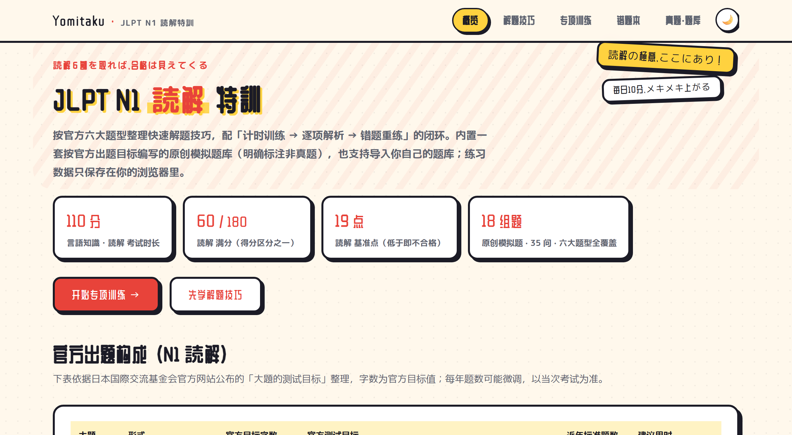
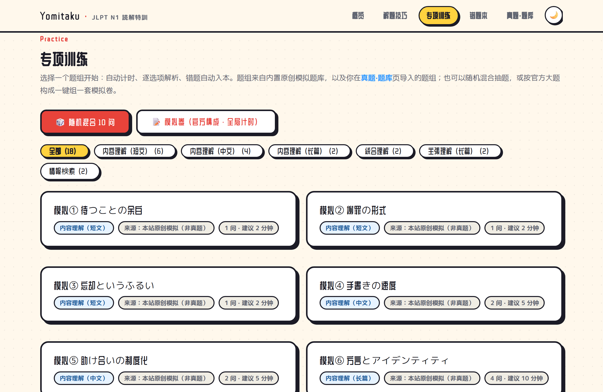
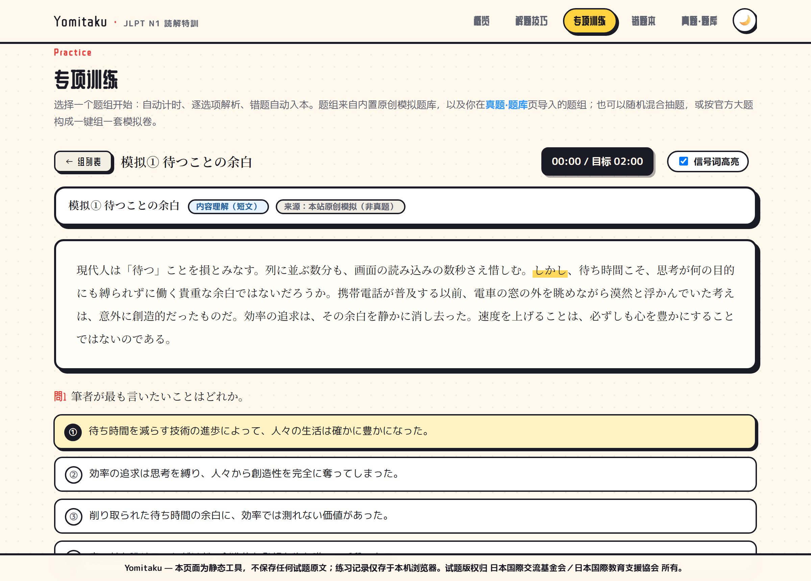
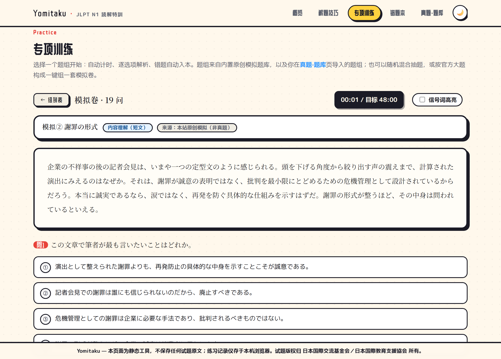
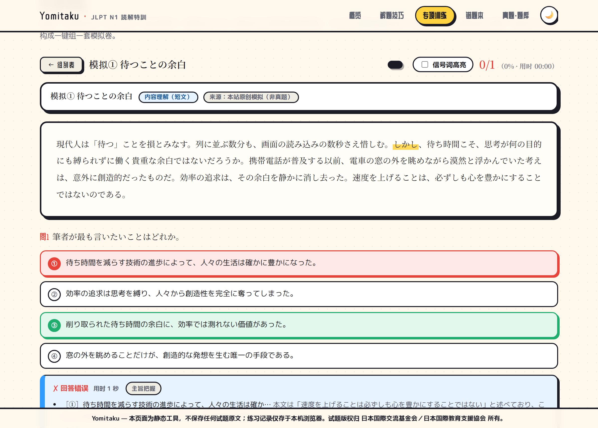
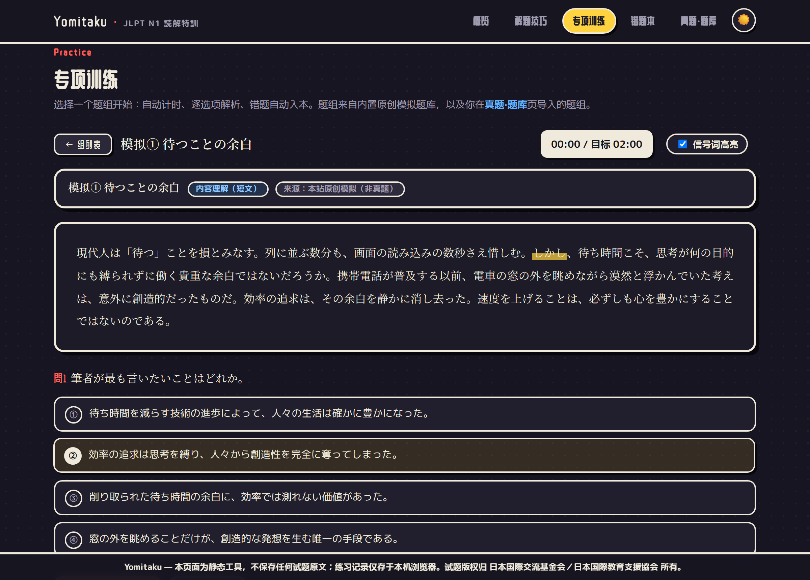
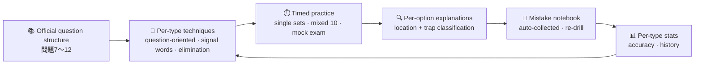

<div align="center">


# 読解特訓 · Yomitaku

**A lean, hardcore JLPT N1 読解 (reading-comprehension) trainer — techniques, timed practice, per-option explanations and a mistake notebook, all in one static page**

[](https://mocas-12.github.io/jlpt-n1-Yomitaku/)
[](https://developer.mozilla.org/en-US/docs/Web/JavaScript)


**[🌐 Live Preview (GitHub Pages)](https://mocas-12.github.io/jlpt-n1-Yomitaku/)**

*Open the page → learn the techniques → timed practice → per-option explanations → re-drill your mistakes*

**English** | [简体中文](./README.zh-CN.md)

</div>

---

## 📖 Table of Contents

- [Features](#-features)
- [Screenshots](#-screenshots)
- [UI Design](#-ui-design)
- [Training Loop](#-training-loop)
- [Question Bank & Copyright](#-question-bank--copyright)
- [Project Structure](#-project-structure)
- [Quick Start](#-quick-start)
- [Development](#-development)
- [Question Bank JSON Format](#-question-bank-json-format)
- [FAQ](#-faq)
- [Privacy & Security](#-privacy--security)
- [License](#-license)

## ✨ Features

- 🧭 **Organized by official question types**: mapped against the JLPT official《大題的測試目標》(test goals of each large question), it compiles dedicated tactics and time budgets for the six big question types of 問題7〜12 (content comprehension short/medium/long passages, integrated comprehension, main-idea comprehension, information retrieval)
- ⚡ **Quick technique library**: question-oriented reading, a quick reference for contrastive/concessive signal words (one-click highlighting during practice), a seven-category elimination checklist for trap options, and a 110-minute time budget table
- ⏱️ **Timed practice**: each question set carries a difficulty-based time budget with a real-time timer; overtime is flagged in red, reproducing exam pacing
- 🔍 **Per-option explanations**: after submitting, the correct answer and your choice are marked, and every option gets a text location plus a trap classification — not just an answer key
- 🔁 **Mistake-notebook loop**: wrong answers are collected automatically; "re-drill all mistakes" is supported and a correct answer removes the item; before the exam, drill only your mistakes
- 📊 **Per-type stats**: accuracy progress bars per question type + practice history — weak points at a glance
- 🎲 **Mixed drill & mock exam**: one tap to shuffle 10 random questions across all types, or assemble a full mock following the official 問題7〜12 blueprint with a global timer; per-question timing shows up in the explanations
- 🔥 **Daily streak**: consecutive practice days derived from your history, shown on the overview
- 📥 **Extensible question bank**: paste JSON / upload a file to import your own question sets (same ID auto-overwrites); export backup supported
- 📴 **Installable & offline (PWA)**: web manifest + a minimal service worker — add to home screen and keep drilling with no network; SEO / Open-Graph social meta tags included
- 🌓 **Dark mode**: follows the system preference with a one-click header toggle — the manga washi theme re-tuned for night reading
- ⌨️ **Keyboard answering**: press 1–4 to pick options for the current question, Enter to submit — desktop drilling at full speed
- 📝 **Session draft**: unsubmitted progress is saved with every answer — accidentally refreshing or closing the tab resumes the session right where you stopped, timer still running
- 🧳 **Record backup**: export/import accuracy stats, history and the mistake notebook as JSON and restore them on any browser (next to the question-bank tools)
- 💾 **Zero backend**: all data lives only in your browser's localStorage — double-click and it works

## 🖼️ Screenshots

| Overview | Practice entries (mixed drill & mock exam) |
| --- | --- |
|  |  |

| Practice (signal-word highlight) | Mock exam (global timer) |
| --- | --- |
|  |  |

| Per-option explanations | Dark mode (夜の和紙) |
| --- | --- |
|  |  |

## 🎨 UI Design

| Element | Design |
| --- | --- |
| Overall style | Washi paper texture (off-white base + vermilion accents + ink-black text), hand-written CSS without frameworks |
| Reading area | Mincho typeface (Noto Serif JP) with double line height and justified alignment, close to exam-paper typesetting |
| Type badges | Blue question-type tags + gray big-question numbers + source badges (original/imported at a glance) |
| Option states | Hover outline → selected indigo → correct green / wrong vermilion; explanation boxes guided by a left vertical rule |
| Signal-word highlighting | 23 categories of logical signal words (しかし・つまり・一方 etc.) highlighted with one click |
| Motion | Page fade-in, progress-bar transitions, toast notices; no heavy animation |
| Dark mode | "Night washi": indigo-ink base + washi-white text, hard shadows stay pure-black silhouettes; follows the system, toggle in the header |

## 🧠 Training Loop



1. **Learn**: study the solution flow, target time and trap checklist for each of the six question types
2. **Practice**: pick a question set, shuffle 10 random questions across all types, or assemble a mock exam; the timer runs against the time budget (a global clock for mixed/mock modes); signal-word highlighting can be enabled in the reading area
3. **Analyze**: after submitting, per-option explanations classify each error into one of seven trap categories — attribution matters more than volume
4. **Drill**: mistakes automatically enter the notebook; re-drill with one click until it is cleared
5. **Review**: the home page aggregates accuracy by question type and practice history for targeted remediation

## 📚 Question Bank & Copyright

> **Honesty first**: JLPT past papers come only from the official source, and every reputable commercial question bank (新完全マスター etc.) is a copyrighted book — no third party may republish them.

- ✅ **Built-in question bank**: 80 sets / 155 questions covering all six question types — **original mock questions** written against the official "test goals of each large question" (word count, ability points, question style), with each set clearly labeled "not a past paper"
- 📖 **Reputable textbook guide**: the "Question Bank Notes & Management" page provides a comparison table for 新完全マスター / 日本語総合攻略 / ドリル&ドリル / the official workbook; transcribe your purchased books and import them to train here
- 🔗 **Official resource links**: question structure, the large-question test-goals PDF, score-band and scaled-score announcements, official free sample PDFs
- 🚫 This project **does not contain or distribute** any copyrighted question text

## 📁 Project Structure

```text
jlpt-n1-Yomitaku/
├── index.html            # Page skeleton: overview / techniques / practice / mistake notebook / bank management
├── manifest.webmanifest  # PWA manifest (installable to home screen)
├── sw.js                 # Service Worker: offline cache (network-first docs / cache-first assets)
├── css/
│   └── style.css         # Washi paper-texture theme styles
├── js/
│   ├── bank.js           # Built-in question bank (original mock questions, editable to extend)
│   └── app.js            # Training engine: timer, scoring, explanations, mistake notebook, stats, import/export
├── public/               # logo.svg · icon-192/512.png · og-banner.png
└── scripts/
    ├── version.mjs       # Rewrites ?v= params and the sw.js cache name from content hashes (zero-dep, idempotent)
    └── make-assets.mjs   # Renders the OG banner & PWA icons via Playwright
```

## 🚀 Quick Start

```bash
git clone https://github.com/Mocas-12/jlpt-n1-Yomitaku.git
cd jlpt-n1-Yomitaku
```

- **Option 1**: simply double-click `index.html` and it works in your browser
- **Option 2 (recommended)**:

```bash
python -m http.server 8123
# Visit http://127.0.0.1:8123
```

> No dependencies to install, nothing to build; a modern browser such as Chrome / Edge is recommended.

## 🧪 Development

The site itself stays zero-dependency; `package.json` exists only for dev-time smoke tests (Playwright, covering the full practice loop, mixed drill and mock exam, unanswered-submit confirm, import validation, dark mode, keyboard answering and its page scope, record backup, mistake-notebook re-drill, session draft restore, file:// double-click mode, offline PWA and data housekeeping). CI runs them automatically before every deploy.

```bash
npm install
npx playwright install chromium
npm test
```

## 📥 Question Bank JSON Format

Paste or upload on the "Question Bank Notes & Management" page; question sets with the same ID auto-overwrite:

```json
[
  {
    "id": "wb2012-q7-1",
    "typeKey": "tanbun",
    "title": "题组标题",
    "source": "来源标注（可选）",
    "minutes": 2,
    "passage": "文章正文，\\n分段（統合理解用 passageA / passageB）",
    "questions": [
      {
        "q": "设问原文",
        "label": "主旨把握",
        "options": ["选项①", "选项②", "选项③", "选项④"],
        "answer": 2,
        "explain": ["选项①解析（可选）", "选项②解析", "正解定位", "选项④解析"]
      }
    ]
  }
]
```

`typeKey` values: `tanbun` (short passage) / `chubun` (medium passage) / `chobun` (long passage) / `togo` (integrated comprehension) / `shucho` (main-idea comprehension) / `joho` (information retrieval).

## ❓ FAQ

<details>
<summary><b>Where are practice records stored? Do they survive switching browsers?</b></summary>

Records live only in the current browser's localStorage. They persist across sessions in the same browser; switching browsers or clearing browser data loses them. For important progress, export a backup from the Question Bank page — both the question bank and your practice records (stats, history, mistake notebook) can be exported as JSON and restored on any browser.
</details>

<details>
<summary><b>Why are there no real past papers?</b></summary>

Past papers are copyrighted by the Japan Foundation / JEES; republishing them on a third-party web page is infringement. The built-in sets are clearly-labeled original mock questions; see the "Question Bank Notes & Management" page for official free sample PDFs and the reputable-textbook guide.
</details>

<details>
<summary><b>How do I import my own questions (e.g., from books I own)?</b></summary>

Transcribing questions yourself and importing them for personal use is fully supported — two ways to do it:
- **AI-assisted (recommended)**: send the question text together with the 「AI 转录提示词」 prompt provided on the Question Bank page to any AI chat (ChatGPT / Claude / etc.); it returns schema-compliant JSON whose per-option explanations match your questions. **Double-check the answer indices before importing** (AI occasionally mis-judges).
- **Manual**: click 「填入示例题组」 to load a complete example set, then replace the fields (including per-question options / answer / explain; the explanations can be deleted entirely) with your own content and click 导入.

Validation errors point to the exact set and question; imported sets appear under 专项训练 right away, and 导出/下载 backs up your bank anytime.
</details>

<details>
<summary><b>JSON import errors?</b></summary>

The page reports the exact problem: the root element must be an array, `typeKey` must be one of the six values, `sourceUrl` (if provided) must start with http(s), every question needs a `q` stem, `options` must have exactly 4 items, `answer` must be an integer 0–3, and `explain` (if provided) must match the length of `options`.
</details>

<details>
<summary><b>Wrong font after opening by double-click?</b></summary>

The reading area uses Noto Serif JP from Google Fonts; when offline it falls back to a system Mincho typeface (Yu Mincho etc.) without affecting functionality.
</details>

## 🔒 Privacy & Security

- 💾 All data stays in your local browser — no account, no backend, no reporting
- 🌐 No network requests except Google Fonts; font loading failure does not affect functionality
- 🚫 Contains no electronic text of any copyrighted exam questions

## 📄 License

This project is for learning and demonstration purposes only; no open-source license is set. Contact the author before reuse.

---

<div align="center">

**Made with 💙 by Unlimited Box**

🐛 [Report an Issue](https://github.com/Mocas-12/jlpt-n1-Yomitaku/issues) · 📧 [a18577y@gmail.com](mailto:a18577y@gmail.com)

</div>
