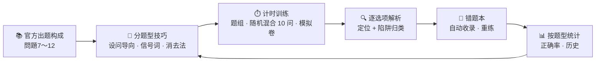

<div align="center">


# 読解特訓 · Yomitaku

**简洁而硬核的 JLPT N1 読解专项训练页 —— 技巧、计时、解析、错题本，一个静态页面全搞定**

[](https://mocas-12.github.io/jlpt-n1-Yomitaku/)
[](https://developer.mozilla.org/zh-CN/docs/Web/JavaScript)


**[🌐 在线体验（GitHub Pages）](https://mocas-12.github.io/jlpt-n1-Yomitaku/)**

*打开页面 → 学技巧 → 计时训练 → 逐项解析 → 错题重练*

[English](./README.md) | **简体中文**

</div>

---

## 📖 目录

- [功能特性](#-功能特性)
- [界面预览](#-界面预览)
- [界面设计](#-界面设计)
- [训练闭环](#-训练闭环)
- [题库与版权说明](#-题库与版权说明)
- [项目结构](#-项目结构)
- [快速开始](#-快速开始)
- [开发与测试](#-开发与测试)
- [题库 JSON 格式](#-题库-json-格式)
- [常见问题](#-常见问题)
- [隐私与安全](#-隐私与安全)
- [许可证](#-许可证)

## ✨ 功能特性

- 🧭 **按官方题型组织**：对照 JLPT 官方《大題的测试目标》整理問題7〜12 六大题型（内容理解短/中/长篇、統合理解、主張理解、情報検索）的专属打法与时间预算
- ⚡ **快速解题技巧库**：设问导向阅读、逆接信号词速查（训练中可一键高亮）、陷阱选项七类消去法 checklist、110 分钟时间预算表
- ⏱️ **计时训练**：每组题按难度设定时间预算，实时计时，超时标红；还原考场节奏
- 🔍 **逐选项解析**：提交后标出正解与误选，每个选项给出定位与陷阱归类，而非只给答案
- 🔁 **错题本闭环**：做错自动收录，支持「重练全部错题」，答对自动移出；考前只刷错题
- 📊 **按题型统计**：各题型正确率进度条 + 练习历史，弱项一目了然
- 🎲 **混合训练与模拟卷**：一键随机混合抽 10 问，或按官方問題7〜12 构成组一套模拟卷（全局计时）；解析中标注每题用时
- 🔥 **连续打卡**：从练习历史推导连续天数，概览页一目了然
- 📥 **题库可扩展**：粘贴 JSON / 上传文件即可导入自己的题组（同 ID 自动覆盖），支持导出备份
- 📴 **PWA 离线可用**：Web App Manifest + 极简 Service Worker，添加到主屏幕后无网络也能刷题；已配 SEO / Open Graph 社交分享标签
- 🌓 **深色模式**：跟随系统偏好，头部一键切换；漫画和纸风为夜间阅读重新调色
- ⌨️ **键盘作答**：数字 1〜4 选择当前题选项、Enter 提交，当前题自动高亮推进
- 📝 **会话草稿**：未提交的练习逐题自动保存——误刷新、误关页面后重新打开即可继续作答，计时照常
- 🧳 **记录可备份**：正确率、历史、错题本一键导出 JSON，换浏览器整体恢复（在「真题·题库」页）
- 💾 **零后端**：所有数据仅存本机浏览器 localStorage，双击即用

## 🖼️ 界面预览

| 概览 | 训练入口（混合 / 模拟卷） |
| --- | --- |
|  |  |

| 训练中（信号词高亮） | 模拟卷（全局计时） |
| --- | --- |
|  |  |

| 逐选项解析 | 深色模式（夜の和紙） |
| --- | --- |
|  |  |

## 🎨 界面设计

| 元素 | 设计 |
| --- | --- |
| 整体风格 | 和风纸质感（米白底 + 朱色强调 + 墨色正文），无框架手写 CSS |
| 阅读区 | 明朝体（Noto Serif JP）双倍行高、两端对齐，贴近试卷排版 |
| 题型徽章 | 蓝底题型标签 + 灰底大题编号 + 来源徽章（原创/导入一目了然） |
| 选项状态 | 悬停描边 → 选中靛蓝 → 正解绿 / 误选朱红，解析框左侧竖线引导 |
| 信号词高亮 | しかし・つまり・一方等 23 类逻辑信号词一键衬底高亮 |
| 动效 | 页面淡入、进度条过渡、Toast 提示；无重型动画 |
| 深色模式 | 「夜の和紙」：靛墨底 + 和纸白文字，硬阴影保持纯黑剪影；跟随系统，头部按钮可切换 |

## 🧠 训练闭环



1. **学**：按六大题型学习对应的解题流程、目标用时与陷阱 checklist
2. **练**：选题组、随机混合抽 10 问，或按官方構成组一套模拟卷；计时器对照时间预算（混合/模拟卷为全局倒计时），阅读区可开启信号词高亮
3. **析**：提交后逐选项解析，错因归入七类陷阱之一，归因比刷量重要
4. **刷**：错题自动进入错题本，一键重练直到清零
5. **看**：首页按题型汇总正确率与练习历史，弱项定向补练

## 📚 题库与版权说明

> **先说实话**：JLPT 真题只有官方一家，市面口碑题库（新完全マスター等）也全是受版权保护的商业书籍，任何第三方都无权转载。

- ✅ **内置题库**：266 组 515 问，覆盖全部六大题型，为参照官方「大題的测试目标」（字数、能力点、设问方式）编写的**原创模拟题**，每组明确标注「非真题」
- 📖 **口碑教材指南**：「题库说明与管理」页整理了新完全マスター／日本語総合攻略／ドリル&ドリル／公式問題集的选书对照表，购书后个人转录导入即可用本页训练
- 🔗 **官方资料直链**：出题构成、大題测试目标 PDF、得点区分与基准点公告、官方免费样题 PDF
- 🚫 本项目**不包含、也不分发**任何受版权保护的试题原文

## 📁 项目结构

```text
jlpt-n1-Yomitaku/
├── index.html            # 页面骨架：概览 / 解题技巧 / 专项训练 / 错题本 / 题库管理
├── manifest.webmanifest  # PWA 清单（可安装到主屏幕）
├── sw.js                 # Service Worker：离线缓存（页面网络优先 / 资源缓存优先）
├── css/
│   └── style.css         # 和风纸质感主题样式
├── js/
│   ├── bank.js           # 内置题库（原创模拟题，可直接编辑追加）
│   └── app.js            # 训练引擎：计时、判分、解析、错题本、统计、导入导出
├── public/               # logo.svg · icon-192/512.png · og-banner.png
└── scripts/
    ├── version.mjs       # 按内容哈希改写 ?v= 版本号与 sw.js 缓存名（零依赖，幂等）
    └── make-assets.mjs   # 用 Playwright 渲染生成 OG 横幅与 PWA 图标
```

## 🚀 快速开始

```bash
git clone https://github.com/Mocas-12/jlpt-n1-Yomitaku.git
cd jlpt-n1-Yomitaku
```

- **方式一**：直接双击 `index.html`，浏览器打开即用
- **方式二**（推荐）：

```bash
python -m http.server 8123
# 访问 http://127.0.0.1:8123
```

> 无需安装依赖、无需构建；建议使用 Chrome / Edge 等现代浏览器。

## 🧪 开发与测试

站点本体保持零依赖；`package.json` 仅用于开发期冒烟测试（Playwright，覆盖训练完整链路、混合训练与模拟卷、未答完提交确认、导入校验正反例、深色模式、键盘作答及其作用域、记录备份、错题重练闭环、会话草稿恢复、file:// 直开、PWA 离线与数据养护）。CI 会在每次部署前自动跑一遍。

```bash
npm install
npx playwright install chromium
npm test
```

## 📥 题库 JSON 格式

在「题库说明与管理」页粘贴或上传，同 ID 题组自动覆盖：

```json
[
  {
    "id": "wb2012-q7-1",
    "typeKey": "tanbun",
    "title": "题组标题",
    "source": "来源标注（可选）",
    "minutes": 2,
    "passage": "文章正文，\\n分段（統合理解用 passageA / passageB）",
    "questions": [
      {
        "q": "设问原文",
        "label": "主旨把握",
        "options": ["选项①", "选项②", "选项③", "选项④"],
        "answer": 2,
        "explain": ["选项①解析（可选）", "选项②解析", "正解定位", "选项④解析"]
      }
    ]
  }
]
```

`typeKey` 取值：`tanbun` 短文 / `chubun` 中文 / `chobun` 长篇 / `togo` 統合 / `shucho` 主張 / `joho` 情報検索。

## ❓ 常见问题

<details>
<summary><b>练习记录存在哪里？换浏览器还在吗？</b></summary>

记录仅存于当前浏览器的 localStorage。同一浏览器重复打开都在；换浏览器或清除浏览器数据会丢失。重要进度请在「真题·题库」页备份——题库与练习记录（正确率/历史/错题本）都支持导出 JSON，换浏览器可整体恢复。
</details>

<details>
<summary><b>为什么没有真题？</b></summary>

真题版权归日本国際交流基金会／JEES 所有，第三方网页转载属侵权。内置题为明确标注的原创模拟题；官方免费样题 PDF 与口碑教材指南见「题库说明与管理」页。
</details>

<details>
<summary><b>如何导入我自己的题目（如手头教材/真题书）？</b></summary>

自己转录、自己导入练习完全支持（个人使用范畴），两种做法任选：
- **AI 代转录（推荐）**：把题目原文和「真题·题库」页提供的「AI 转录提示词」一起发给任意 AI（ChatGPT / Claude / 豆包等），即可生成格式合规、逐选项解析与题目对应的题库 JSON。**导入前务必核对正解下标**（AI 偶尔会判错题）。
- **手动转录**：点「填入示例题组」载入完整示例，把字段（含每题 options / answer / explain，解析可整段删除）替换成你的题目后导入。

导入报错会精确到第几组第几题；成功后「专项训练」页立即可练，记得用「导出/下载」随时备份。
</details>

<details>
<summary><b>导入 JSON 报错？</b></summary>

页面会提示具体位置：根元素必须是数组、`typeKey` 必须是六个取值之一、`sourceUrl` 若提供须以 http(s) 开头、每题必须有 `q`（设问原文）、`options` 恰好 4 项、`answer` 为 0〜3 的整数、`explain` 若提供需与 `options` 等长。
</details>

<details>
<summary><b>双击打开后字体不对？</b></summary>

阅读区使用 Google Fonts 的 Noto Serif JP，离线时自动回退到系统明朝体（Yu Mincho 等），不影响使用。
</details>

## 🔒 隐私与安全

- 💾 全部数据仅存本机浏览器，无账号、无后端、无上报
- 🌐 除 Google Fonts 字体外无任何网络请求，字体加载失败不影响功能
- 🚫 不包含任何受版权保护试题的电子文本

## 📄 许可证

本项目用于学习与演示，以 [MIT 许可证](./LICENSE) 开源；欢迎复用。

---

<div align="center">

**Made with 💙 by Unlimited Box**

🐛 [问题反馈](https://github.com/Mocas-12/jlpt-n1-Yomitaku/issues) · 📧 [a18577y@gmail.com](mailto:a18577y@gmail.com)

</div>
